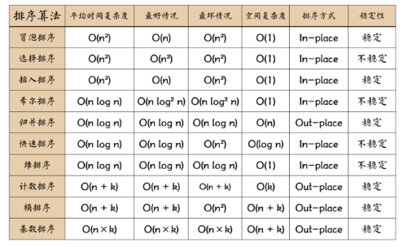

<!-- --- -->
typora-copy-images-to: p
---

#10道题「Q1~Q10」

## ★Q1

1.请写出一个符合 W3C 规范的 HTML 文件，要求

1. 页面标题为「我的页面」
2. 页面中引入了一个外部 CSS 文件，文件路径为 `/style.css`
3. 页面中引入了另一个外部 CSS 文件，路径为 `/print.css`，该文件仅在打印时生效
4. 页面中引入了另一个外部 CSS 文件，路径为 `/mobile.css`，该文件仅在设备宽度小于 500 像素时生效
5. 页面中引入了一个外部 JS 文件，路径为 `/main.js`
6. 页面中引入了一个外部 JS 文件，路径为 `/gbk.js`，文件编码为 GBK
7. 页面中有一个 SVG 标签，SVG 里面有一个直径为 100 像素的圆圈，颜色随意

提示：本题 5 分

### ◇参考资料

- [css 为要打印的页面设置css样式表的几种方法](http://www.manongjc.com/article/293.html)
- [Css文件引用的最优方法](https://segmentfault.com/a/1190000004580060)
- [css3根据分辨率引用不同样式文件](http://hovertree.com/h/bjaf/70rg4j0a.htm)
- [UTF-8页面引用外部编码为GBK的JS文件编码的处理](http://js8.in/2009/12/11/%E5%AF%B9%E5%BC%95%E7%94%A8%E5%A4%96%E9%83%A8javascript%E9%A1%B5%E9%9D%A2%E7%BC%96%E7%A0%81%E5%A4%84%E7%90%86/)
- [GB2312、GBK、GB18030 这几种字符集的主要区别是什么？](https://www.zhihu.com/question/19677619)
- [新媒体、自媒体、社会化媒体的联系和区别](https://baike.baidu.com/tashuo/browse/content?id=d488195b1bcdc344bbb0b100&lemmaId=6206)
- [入门——SVG](https://developer.mozilla.org/zh-CN/docs/Web/SVG/Tutorial/Getting_Started)
- [SVG简单使用](https://www.jianshu.com/p/978b59a2e756)

### ◇偶遇的Q&A

- 媒体类型？什么鬼？

  > 关于[媒体](https://hanyu.baidu.com/s?wd=%E5%AA%92%E4%BD%93&device=pc&from=home)、[多媒体](https://hanyu.baidu.com/s?wd=%E5%A4%9A%E5%AA%92%E4%BD%93&from=zici)、[媒介](https://hanyu.baidu.com/s?wd=%E5%AA%92%E4%BB%8B&from=zici)的定义：
  >
  > 媒体有两层含义，一是承载信息的物体，二是指储存、呈现、处理、传递信息的实体。 
  >
  > 总而言之，媒体是指传播信息的媒介 
  >
  > 多媒体：多种媒体的综合，一般包括文本，声音和图像等多种媒体形式。 
  >
  > 而媒介则是「介绍或导致双方发生关系的人或事物」。 
  >
  > 说实在的我有点晕……
  >
  > 那么[媒体类型](https://www.w3.org/html/ig/zh/wiki/CSS2/media)：
  >
  > 样式表的一大重要特性就是指定文档如何呈现在不同媒体之中，这些媒体包含：屏幕、纸张、语音合成器以及盲文设备等。 

##  ★Q2

2.[2016年腾讯前端面试题](https://github.com/Bless-L/MyBlog/blob/master/post/2016%E8%85%BE%E8%AE%AF%E5%AE%9E%E4%B9%A0%E7%94%9F%E5%89%8D%E7%AB%AF%E9%9D%A2%E8%AF%95%E7%BB%8F%E5%8E%86%E5%8F%8A%E6%80%BB%E7%BB%93%EF%BC%88%E4%BA%8C%EF%BC%89.md)：
移动端是怎么做适配的？

回答要点：

1. meta viewport
2. 媒体查询（[教程](https://xiedaimala.com/courses/003b1951-22af-4821-ad80-d2880c0074eb/tasks/f61cdba2-cea3-4da1-90b6-3f37bd8d6d5b)）
3. 动态 rem 方案（[教程](https://xiedaimala.com/courses/003b1951-22af-4821-ad80-d2880c0074eb/tasks/37a886be-169c-4a99-8bfb-1a993be8119d)）

这三个知识点只有第一个我有讲过，你需要自学第二点和第三点。
如果大家在这道题上都答得不好，我会在考试后直播这两节课的录屏。（因为我觉得视频里已经讲得很好了，没必要重新讲一遍）

提示：本题15分，每个知识点 5 分。你会发现平时不写博客，遇到面试就会变成哑巴。

### ◇参考资料

- [响应式 Web 设计 - Viewport](http://www.runoob.com/css/css-rwd-viewport.html)
- [巧妙使用CSS媒体查询(Media Queries)和JavaScript判断浏览器设备类型的好方法](http://www.webhek.com/post/device-state-detection-css-media-queries-javascript.html)
- [CSS3 Media Queries](https://www.w3cplus.com/content/css3-media-queries)
- [使用了媒体查询的著名站点](http://mediaqueri.es/)
- [CSS媒体查询](https://developer.mozilla.org/zh-CN/docs/Web/Guide/CSS/Media_queries)
- [移动Web适配利器-rem](http://www.alloyteam.com/2016/03/mobile-web-adaptation-tool-rem/)

## ★Q3

3.[2017年腾讯前端实习面试题（二面）](https://earthsplitter.github.io/2017/03/31/2017%E8%85%BE%E8%AE%AF%E5%AE%9E%E4%B9%A0%E7%BB%8F%E9%AA%8C%E6%80%BB%E7%BB%93/)：
用过CSS3吗? 实现圆角矩形和阴影怎么做?

提示：本题 5 分

### ◇参考资料

- [CSS3圆角详解](http://www.ruanyifeng.com/blog/2010/12/detailed_explanation_of_css3_rounded_corners.html)
- [工具网站实现阴影](https://www.cssmatic.com/box-shadow)

## ★Q4

4.出处同上（一面二面都问了）：
什么是闭包，闭包的用途是什么？

我在课堂上讲过闭包是什么，也演示过闭包的用途，但是并没有帮大家总结。
请自行搜索。

提示：本题 15 分

### ◇Q&A

- 为什么this

### ◇参考资料

- [学习Javascript闭包（Closure）](http://www.ruanyifeng.com/blog/2009/08/learning_javascript_closures.html)
- [JS 中的闭包是什么？](https://zhuanlan.zhihu.com/p/22486908)

 

##  ★Q5

5.出处同上：

call、apply、bind 的用法分别是什么？出处同上：

call、apply、bind 的用法分别是什么？

提示：本题 15 分

### ◇A

有这么一段demo：

```js
function x(yyy) {
    console.log(this)
    console.log(yyy)
}
```

注意：call、apply和bind 是Function对象自带的三个方法 。

当我这样调用x：`x(666)`，那么此时的`this`在非严格模式下是`window`，若严格模式下是`undefined`

当我使用了call：`x.call(666)`，那么这个this就是 `new Number(666)`。而`x`的参数则是`undefined`，如你这样做`x.call(666,777)`，那么777就是x的实参了啊

当我使用了apply：`x.apply(666)`，其结果与`x.call(666)`一致。照葫芦画瓢与call一样的做法「`x.apply(666,777)`」，结果报错了哈，这一点就是它与call的区别了，因为`x.apply()`除去第一个参数决定this的值以外，第二个参数必须是数组或者是伪数组，不然就报错，所以你得这样 写`x.apply(666,[777])`或者这样 `x.apply(666,{0:777,length:1})`

当我使用了bind：`x.bind(666)`，返回了函数x给我，而且x并没有被调用；如何做到与 `x.call(666)`一致的结果？直接这样 `x.bind(666)()`。所以其第一个圆括号的参数是this的值，而第二个圆括号是x函数的参数，而且不需要是数组或者是伪数组什么的，如 `x.bind(666)(777)`

所以它们三者的主要作用是改变函数中的this指向 ，而且都可以利用后续参数传参 。如果以call为参照物的话，那么apply的「参数」就是它的特点，而bind是「返回对应函数，便于稍后调用」 就是它的特点

ps:

关于this无须在意，只要弄清此时此刻它的值是谁即可，还有就是得要分清this的常见用法：

- 纯粹的函数调用 
- 作为对象方法的调用 
- 作为构造函数调用 


### ◇参考资料

- [★JavaScript中的普通函数与构造函数](http://www.cnblogs.com/SheilaSun/p/4398881.html)
- [★了解JavaScript的执行上下文](http://yanhaijing.com/javascript/2014/04/29/what-is-the-execution-context-in-javascript/)
- [★Javascript的this用法](http://www.ruanyifeng.com/blog/2010/04/using_this_keyword_in_javascript.html)
- [你不知道的执行上下文](https://zhuanlan.zhihu.com/p/26011572)
- [★JS 中的 call、apply、bind 方法](https://juejin.im/entry/58785801128fe1006be5c6a9)
- [★this 的值到底是什么？一次说清楚](https://zhuanlan.zhihu.com/p/23804247)
- [句柄是什么？](https://www.zhihu.com/question/27656256)
- [如何理解和熟练运用js中的call及apply？](https://www.zhihu.com/question/20289071)
- [【优雅代码】深入浅出 妙用Javascript中apply、call、bind](https://www.cnblogs.com/coco1s/p/4833199.html)

## ★Q6

6.出处同上：
请说出至少 8 个 HTTP 状态码，并描述各状态码的意义。

例如：

状态码 200 表示响应成功。

提示：本题 5 分


### ◇A

- 204：服务器成功处理了请求，没有返回任何内容 
- 301：资源（网页等）被永久转移到其它URL
- 404 ： 请求的资源（网页等）不存在
- 500 ：服务器内部错误
- 400 ：客户端请求的语法错误，服务器无法理解 
- 403 ：服务器理解请求客户端的请求，但是拒绝执行此请求 
- 408 ：服务器等待客户端发送的请求时间过长，超时 
-  200 ：表示响应成功。 

###  ◇参考资料

- [HTTP状态码](http://www.runoob.com/http/http-status-codes.html)
- [HTTP状态码总结](https://blog.csdn.net/liuxinghao/article/details/50477415)
- [HTTP状态码](https://zh.wikipedia.org/wiki/HTTP%E7%8A%B6%E6%80%81%E7%A0%81)

##  ★Q7

7.出处同上：
请写出一个 HTTP post 请求的内容，包括四部分。
其中
第四部分的内容是 username=ff&password=123
第二部分必须含有 Content-Type 字段
请求的路径为 /path

提示：本题 15 分

### ◇A

```http
POST /path HTTP/1.1
Host: www.baidu.com
User-Agent: curl/7.54.1
Accept: */*
Content-Length: 24
Content-Type: application/x-www-form-urlencoded

username=ff&password=123
```

我直接这样做了：

` curl -X POST -d "username=ff&password=123" -s -v -H "Frank: xxx" -- "https://www.baidu.com/path"` 

###  ◇参考资料

- [HTTP协议简介](https://www.liaoxuefeng.com/wiki/001374738125095c955c1e6d8bb493182103fac9270762a000/001386832653051fd44e44e4f9e4ed08f3e5a5ab550358d000)

## ★Q8

8.请说出至少三种排序的思路，这三种排序的时间复杂度分别为

1. O(n*n)
2. O(n log2 n)
3. O(n + max)

提示：本题 5 分，因为没让你写代码，请自行搜索各排序的时间复杂度

### ◇A

第一种：冒泡排序

如果有5个数字的话，默认就第一个数字最小。假设想要从小到大排列，那么开始两两比较，左边大于右边的话，则交换位置，如此类推即可

第二种：希尔排序

1. 确定数组的长度L
2. 对数组元素进行分组，第一次分为`L*1/2`（向下取整）个组，设为d1个组
3. 把所有距离为 d1 的倍数的元素看成一组 
4. 各组内进行插入排序
5. 第二次分组，一般分为d1*1/2个组，设为d2，照葫芦画瓢，各组进行插入排序
6. 如此类推，直到d~i~ = 1 (i>=1)，即所有元素都在一组了，最后对这个组进行插入排序

第三种：计数排序

1. 分为入桶和出桶
2. 入桶：数据的最大值即是桶的数量，把数据按一一对应的方式扔到各自的桶里面去
3. 出桶：把桶里的数据依次push到数组里去

- ps：

  

  

### ◇参考资料

- [★如何理解算法时间复杂度的表示法O(n²)、O(n)、O(1)、O(nlogn)等？](https://www.zhihu.com/question/21387264)
- [★排序算法](https://zh.wikipedia.org/wiki/%E6%8E%92%E5%BA%8F%E7%AE%97%E6%B3%95#%E6%8E%92%E5%BA%8F%E7%AE%97%E6%B3%95%E5%88%97%E8%A1%A8)
- [★常见排序算法 - 希尔排序 (Shell Sort)](http://bubkoo.com/2014/01/15/sort-algorithm/shell-sort/)
- [（数据结构）十分钟从零搞定时间复杂度（计算算法的时间复杂度）](https://www.jianshu.com/p/f4cca5ce055a)
- [★如何清晰的理解算法中的时间复杂度？](https://www.zhihu.com/question/20196775)
- [常见的感人逻辑](https://www.douban.com/group/topic/87759103/)

## Q9

9.著名前端面试题：
一个页面从输入 URL 到页面加载显示完成，这个过程中都发生了什么？

这一题是在挖掘你的知识边界，所以你知道多少就要答多少。

可以先查阅一些资料再查，但是不要把自己不懂的东西放在答案里，面试官会追问的。

提示：本题 5 分，因为目前我们知道的不多。

### ◇A

1. 分割URL为几个部分：协议、网络地址、资源路径
2. 域名解析网络地址
3. 发起网络连接
4. 浏览器与服务器通信：服务器处理请求，响应内容返回给浏览器
5. 浏览器与服务器断开连接

### ◇参考资料

- [从输入 URL 到页面加载完成的过程中都发生了什么](https://zhuanlan.zhihu.com/p/23155051)
- [从输入 URL 到页面加载完的过程中都发生了什么事情？](https://www.guokr.com/question/554991/)

 

##  Q10

10.著名面试题：
如何实现数组去重？
假设有数组 array = [1,5,2,3,4,2,3,1,3,4]
你要写一个函数 unique，使得
unique(array) 的值为 [1,5,2,3,4]
也就是把重复的值都去掉，只保留不重复的值。

要求：

1. 不要做多重循环，只能遍历一次
2. 请给出两种方案，一种能在 ES 5 环境中运行，一种能在 ES 6 环境中运行（提示 ES 6 环境多了一个 Set 对象）

提示：本题 15 分，网上有很多答案可以参考。

### ◇A

第一次想法：

排序后，使用forEach解决

```js
var array = [1,5,2,3,4,2,3,1,3,4];
array.sort()
function x(value,index,arr) {
    var array = []
//     console.log(1)
//     console.log(arr[index])
    console.log(arr)
    if(arr[index] === arr[index+1]){
        array.push(arr[index])
    }
    console.log(array)
    return array
}
console.log(array.forEach(x))
```

错了，每回调一次array就释放了啊

我想了一想，直接扔到同一个函数里不就可以了吗？

- ES5的环境：

```js
var array = [1,5,2,3,4,2,3,1,3,4]
function unique(xxx) {
    xxx.sort()
    var array1 = []
    xxx.forEach(function(value,index,arr) {
        if(value !== arr[index+1]){
        array1.push(value)
    	}
    })
    return array1
}
unique(array) //[1, 2, 3, 4, 5]
```

这里用到了sort()、forEach()「回调的3个参数都用到了啊」、push()

可这是排序好了的结果啊！额……可依旧做到了去除重复啊

ES6的语法，直接搜索set，找到

- ES6的环境

```js
function unique1(xxx){
    const s = new Set();
    let arr = []
    xxx.forEach(x => s.add(x))

    for (let i of s) {
        arr.push(i)
    }
    return arr
}
unique1(array) // [1, 5, 2, 3, 4]
```

我不知道let和const的区别

### ◇A-2

- ES5：

```js
var array = [1,5,2,3,4,2,3,1,3,4]
function unique(xxx){
  var arr = []
  var hash = {}
  for(var i=0; i<xxx.length; i++){
    if(hash[xxx[i]] === undefined){
      arr.push(xxx[i])
      hash[xxx[i]] = 0
    }
  }
  return arr
}
unique(array) //[1, 5, 2, 3, 4]
```

关键在于再增加一个hash的数据结构啊，根据这个hash，就可以找到答案了啊

- ES6：

```js
function unique1(xxx) {
	return [...new Set(xxx)]
}
unique1(array) //[1, 5, 2, 3, 4]
```

厉害了，es6拓展运算符


### ◇参考资料

- [JavaScript forEach() 方法](http://www.runoob.com/jsref/jsref-foreach.html)
- [Set——阮一峰](http://es6.ruanyifeng.com/#docs/set-map)
- [如何实现数组去重？](https://www.jianshu.com/p/4e4ac6a05f6b)
- [ES6---扩展运算符和rest‘...’(三点运算符)，在数组、函数、set/map等中的应用](https://blog.csdn.net/Wbiokr/article/details/67647753)